# [Curso Angular 17 para el trabajo: Prettier + ESlint + Husky + Lintstaged](https://www.youtube.com/watch?v=gRMuLqOYIB0&t=16s)

- Curso tomado del canal de Youtube de LogiDev.
- This project was generated with [Angular CLI](https://github.com/angular/angular-cli) version 17.3.5.

---

## [Prettier](https://prettier.io/)

Es una herramienta de formateo de código. Su objetivo principal es asegurarse de que tu código se vea consistente y ordenado, sin importar quién lo haya escrito.

`Prettier` se encarga de ajustar el formato del código (por ejemplo, el espaciado, el uso de comillas, la longitud de las líneas, etc.) según reglas predefinidas. Esto hace que sea más fácil de leer y mantener el código, ya que todos los desarrolladores en un proyecto siguen el mismo estilo.

### Cómo generar configuraciones de prettier

A modo introductorio, vamos a ver cómo podemos generar configuraciones de prettier para usarlo en nuestros proyectos. El primer paso es ir a la siguiente dirección https://prettier.io/playground/ donde observaremos una interfaz dividido en 3 secciones:

1. Configuraciones
2. Código a la que se aplicarán las configuraciones
3. Vista previa del código con configuraciones aplicadas

Las configuraciones que realicemos debe ser de acuerdo a nuestras necesidad, de acuerdo al proyecto en el que vamos a trabajar, en ese sentido, todo el equipo debe estar de acuerdo con estas configuraciones, dado que todos vamos a trabajar con lo mismo.

Suponiendo que ya hemos jugado con las configuraciones y tenemos el que necesitamos para nuestro proyecto. El siguiente paso sería generar el `json` de estas configuraciones, para eso, damos clic en el botón `Copy config JSON`, tal como se ve a continuación:

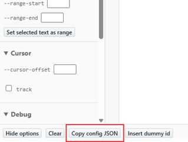

Como resultado, tendremos copiado un json con las configuraciones realizadas que podemos usarlo más adelante en nuestro editor de código.

```json
{
  "arrowParens": "always",
  "bracketSameLine": false,
  "bracketSpacing": true,
  "semi": true,
  "experimentalTernaries": false,
  "singleQuote": false,
  "jsxSingleQuote": false,
  "quoteProps": "as-needed",
  "trailingComma": "all",
  "singleAttributePerLine": false,
  "htmlWhitespaceSensitivity": "css",
  "vueIndentScriptAndStyle": false,
  "proseWrap": "preserve",
  "insertPragma": false,
  "printWidth": 120,
  "requirePragma": false,
  "tabWidth": 2,
  "useTabs": false,
  "embeddedLanguageFormatting": "auto"
}
```

## [ESLint](https://eslint.org/)

Es una herramienta para identificar y corregir problemas en tu código Javascript o Typescript. A diferencia de Prettier, que se enfoca en el formato del código, `ESLint` se centra en encontrar errores y problemas de calidad del código, como variables no utilizadas, errores de sintaxis, problemas de rendimiento y buenas prácticas de programación. `ESLint` es altamente configurable, lo que significa que puedes definir tus propias reglas o usar reglas predefinidas según los estándares de la comunidad.

Al igual que prettier, `ESLint` también tiene su [playground](https://eslint.org/play/) donde podemos jugar buscando las configuraciones que necesitemos, aunque como se mencionó en el párrafo anterior, `ESLint` viene con configuraciones predefinidas.

## [Husky](https://typicode.github.io/husky/get-started.htmly)

Es una herramienta que permite ejecutar scripts de Git Hooks de forma sencilla. Los Git Hooks son scripts que Git ejecuta antes o después de ciertos eventos, como commits, push o merges.

- Es una herramienta que permite ejecutar scripts de `Git hooks`, como `pre-commit`, `pre-push`, `post-commit`, `post-push`, etc.
- Te permite automatizar tareas como la ejecución de linters, formateadores, pruebas, y otras verificaciones antes de realizar commits o push.
- Con Husky, puedes asegurarte de que tu código siempre pase ciertas verificaciones antes de ser enviado al repositorio.

Ten en cuenta que existen hooks del lado del cliente y servidor.

- `Hooks del lado del cliente`: quien va a ejecutar la acción del `commit` o `push` es el desarrollador, entonces los `hooks` que se ejecutarán del lado del cliente serán los `pre-commit`, `pre-push`, `post-commit`, `post-push`.

- `Hooks del lado del servidor`: suponiendo que el repositorio a donde estamos pusheando el código está en `GitHub`, entonces, en el servidor el repositorio detectará que se está haciendo un push, por lo que se se activará un hook del lado del servidor y realizará alguna acción como verificar o ejecutar alguna acción, etc.

**Nota**
- Nosotros estaremos aplicando los `Git Hooks` del lado del cliente, específicamente nos enfocaremos en el `pre-commit`.
- Utilizaremos `Husky` para poder ejecutar `Prettier` y `ESLint` antes de realizar algún `commit` o `push`.

### Funcionamiento de Husky

Como developer hago mi `git commit`, la herramienta `Husky` detectará qué `hook` estamos utilizando de git, en nuestro caso será `pre-commit`. En ese `pre-commit` nosotros colocaremos que se desencadene la ejecución de `Prettier` (formatee nuestro código) y `ESLint` (inspeccione nuestro código a ver si hay algún problema de codificación). Si todo está bien, entonces se procede a realizar el `commit`, caso contrario no se ejecutará el `commit`.

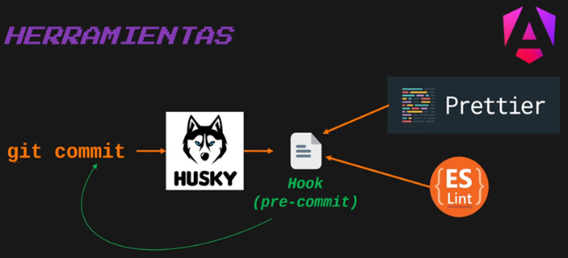

## [LintStaged](https://github.com/lint-staged/lint-staged)

Es una librería que detecta qué archivos han sido modificados para que se apliquen únicamente a ellos las reglas que nosotros indiquemos: `format`, `linter`, etc. En otras palabras, si no usamos esta librería de `LintStaged` las reglas que hayamos definido `format`, `linter`, etc. se aplicarán a todo el proyecto.

---

# Configurando VS Code y Angular para usar herramientas de calidad de código

---

## Extensiones en VS Code

Para el tema de calidad del código necesitamos instalar las siguientes extensiones en nuestro VS Code:

- Prettier - Code formatter
- ESLint

## Estableciendo Prettier como formateador por defecto

Primero debemos instalar la dependencia de `Prettier` en nuestro VS Code. Luego debemos establecer Prettier como formateador por defecto de la siguiente manera.

`Primer paso`, en un archivo cualquiera damos clic secundario y seleccionamos `Format Document With...`.

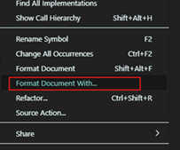

`Segundo paso`, configuramos el formateador por defecto.

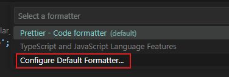

`Tercer paso`, seleccionamos a `Prettier` como nuestro formateador por defecto.

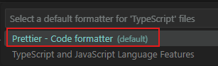

## Activar Configuración Requerida de Prettier

`Prettier: Require Config`, requiere un archivo de configuración `Prettier` para formatear. Esta configuración le dice a VS Code que formatee el código del proyecto en base a un archivo de configuración de `Prettier` llamada `.prettierrc` (si es que lo tiene) que estará ubicada en la raíz del proyecto. Este archivo de configuración `.prettierrc` tendrá el `.json` que copiamos de la página de playground de prettier. En otras palabras, si el archivo `.prettierrc` está presente en el proyecto, entonce que formatee el código en base a las reglas que tenga definida en su interior.

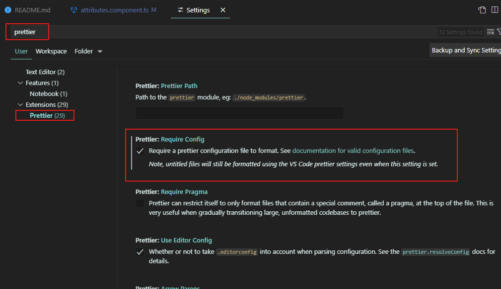

**NOTA**

> En nuestro caso no hemos definido el archivo `.prettierrc` en el proyecto de Angular, por lo tanto, las reglas que aplicará `Prettier` para formatear el código será en base a las reglas que tenga definida la extensión de `Prettier` que instalamos en nuestro `VS Code`. Además, recordar que hemos sido explícitos al seleccionar a `Prettier` como formateador por defecto para el proyecto.

---
# Instalando Prettier y ESLint al proyecto de Angular

---

## [Instalando ESLint](https://github.com/angular-eslint/angular-eslint)

En nuestro proyecto de Angular, instalaremos la dependencia de [angular-eslint](https://github.com/angular-eslint/angular-eslint) con el siguiente comando:

```bash
$ ng add @angular-eslint/schematics
```

Luego de la instalación, en el `package.json` a parte de agregar las dependencias, se agregó automáticamente un script en el apartado de `scripts`:

```json
"scripts": {
  ...
  "lint": "ng lint",
},
```

Además, veremos que nos ha creado un archivo llamado `.eslintrc.json` en nuestra aplicación de `Angular 17`. Ahora, si estuvieramos usando la `versión 18 de Angular`, el archivo que crearía sería un `eslint.config.js`. Ambos representan lo mismo, solo que en una versión está en `json` y en la otra en un archivo de `JavaScript`.

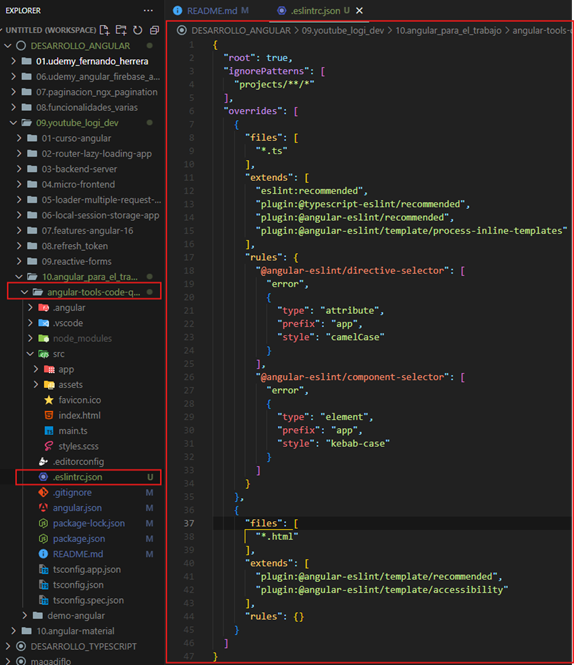

### Ejecutando manualmente ESLint

Recordemos que cuando instalamos `ESLint` se nos agregó automáticamente un script en el `package.json`. Así que en este apartado ejecutaremos dicho script para poner en ejecución `ESLint` y verifique si tenemos algún error en nuestro proyecto.

```bash
M:\PROGRAMACION\DESARROLLO_ANGULAR\09.youtube_logi_dev\10.angular_para_el_trabajo\angular-tools-code-quality (main -> origin)
$ ng lint

Linting "angular-tools-code-quality"...

All files pass linting.
```

Como observamos, no tenemos ningún error `todos los archivos han pasado la revisión de estilo`.

## [Instalando Prettier](https://prettier.io/docs/en/install)

En nuestro proyecto de Angular, instalaremos la dependencia de [prettier](https://prettier.io/docs/en/install) con el siguiente comando:

```bash
$ npm install --save-dev --save-exact prettier
```

Luego, manualmente, en el archivo `package.json` agregaremos el script siguiente para ejecutar `prettier`:

```json
"scripts": {
  ...
  "format": "prettier --write \"./src/**/*.{ts,json,html,scss}\""
}
```

### Ejecutando manualmente Prettier

Luego de agregar la dependencia de prettier y configurar el script manualmente, vamos a ejecutar precisamente el script para formatear todo nuestro proyecto usando prettier:

```bash
M:\PROGRAMACION\DESARROLLO_ANGULAR\09.youtube_logi_dev\10.angular_para_el_trabajo\angular-tools-code-quality (main -> origin)
$ npm run format

> angular-tools-code-quality@0.0.0 format
> prettier --write "./src/**/*.{ts,json,html,scss}"

src/app/app.component.html 86ms (unchanged)
src/app/app.component.scss 50ms (unchanged)
src/app/app.component.ts 111ms (unchanged)
src/app/app.config.ts 13ms (unchanged)
src/app/app.routes.ts 4ms (unchanged)
src/index.html 16ms (unchanged)
src/main.ts 11ms (unchanged)
src/styles.scss 3ms (unchanged)
```

Como observamos, todos los archivos está correctamente formateados, por eso es que no se han producido cambios `(unchanged)`.

**IMPORTANTE: La primer vez ejecutar manualmente ESLint y Prettier**

> `La primera vez` sí deberíamos ejecutar los comandos manualmente, por separado (`npm run format` y `ng lint`) para que, tanto el formateo como la corrección del código se aplique a todo el proyecto. Las siguientes veces, dejaremos que en automático `husky` ejecute los comandos que definamos en el archivo `pre-commit`, pero nos vamos a apoyar de la librería `lint-staged` para que ejecute el `formateo` y el `lint` únicamente a aquellos archivos que han cambiado.


## Reiniciar Visual Studio Code para aplicar cambios

En `Visual Studio Code` cuando se instala una dependencia que tenga que ver con el `linter` o con el `formateo`, lo ideal sería reiniciar el editor para que los cambios se apliquen.

---
# Automatizando ejecución de Prettier y ESLint

En los apartados de instalación de `Prettier` y `ESLint` al proyecto de Angular, nosotros como desarrolladores hemos ejecutado manualmente cada una de estas herramientas, pero la idea es que estas se ejecuten automáticamente, por ejemplo antes de realizar el commit. Esta característica nos la brinda `Husky` que es lo que veremos en este apartado.

---

## [Instalando Husky en Angular](https://typicode.github.io/husky/get-started.htmly)

En nuestro proyecto de Angular, instalaremos la dependencia de [husky](https://typicode.github.io/husky/get-started.htmly) con el siguiente comando:

```bash
$ npm install --save-dev husky
```
Luego que hemos instalado la dependencia, ejecutamos el comando init de husky para poder hacer uso de los `Git Hooks`. El comando init simplifica la configuración de Husky en un proyecto. Crea un script de confirmación previa en `.husky/` y actualiza el script de preparación en `package.json`. Se pueden realizar modificaciones más adelante para adaptarlas a su flujo de trabajo.

```bash
$ npx husky init
```

Luego de haber ejecutado el comando init, veremos que se nos habrá creado el directorio `.husky` conteniendo un `Git Hook`, en este caso el `pre-commit`.

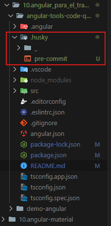

Los comandos que vamos a colocar en el archivo `pre-commit` deberían existir en los `scripts` del `package.json`, por ejemplo, nosotros tenemos los siguientes comandos en el `scripts` del `package.json`:

```json
"scripts": {
  "ng": "ng",
  "start": "ng serve",
  "build": "ng build",
  "watch": "ng build --watch --configuration development",
  "test": "ng test",
  "lint": "ng lint",
  "format": "prettier --write \"./src/**/*.{ts,json,html,scss}\"",
  "prepare": "husky"
},
```

Por lo que, fácilmente podríamos definir el siguiente comando en el archivo `pre-commit`:

```bash
npm run format
```

Ahora, supongamos que tenemos instalado una librería y queremos ejecutarla, además conocemos el comando con el que se ejecuta dicha librería `(ng lint --fix)`, en ese caso, no es necesario tenerlo en la sección de `scripts`, simplemente colocándolo en el archivo `pre-commit`, el comando va a ser reconocido. Por ejemplo:

```bash
npm run format
ng lint --fix
```

El primer comando que es el `format` está en los `scripts`, mientras que el segundo comando no está, es decir, podríamos haberlo usado el `npm run lint` porque `lint` sí está como clave en los `scripts` y este ejecutaría el comando `ng lint`, pero para demostrar que se puede ejecutar comandos que no están en los scripts es que colocamos directamente el `ng lint --fix` (--fix, que `intente` solucionar si encuentra algún error, solo si puede solucionarlo).

> Luego, si intentamos hacer un `commit` en `automático` se ejecutarán los comandos definidos en el archivo `pre-commit`.

**IMPORTANTE**

> `La primera vez` sí deberíamos ejecutar los comandos manualmente, por separado (`npm run format` y `ng lint`) para que, tanto el formateo como la corrección del código se aplique a todo el proyecto. Las siguientes veces, dejaremos que en automático `husky` ejecute los comandos que definamos en el archivo `pre-commit`, pero nos vamos a apoyar de la librería `lint-staged` para que ejecute el `formateo` y el `lint` únicamente a aquellos archivos que han cambiado.

## [Instalando dependencia de Lint-Staged en Angular](https://github.com/lint-staged/lint-staged)

Instalamos la dependencia de [lint-staged](https://github.com/lint-staged/lint-staged) a través del siguiente comando:

```bash
$ npm install --save-dev lint-staged
```

### [Configurando lint-staged](https://github.com/lint-staged/lint-staged?tab=readme-ov-file#configuration)

`Lint-staged` puede ser configurado de muchas formas. En nuestro caso lo haremos de la siguiente manera. 

- En la raíz del proyecto crearemos el archivo `.lintstagedrc.json` con las siguientes configuraciones:

  ```json
  {
    "*.ts": ["prettier --write", "eslint"],
    "*.html": ["eslint", "prettier --write"],
    "*.scss": "prettier --write"
  }
  ```

En el archivo `json` anterior estamos diciendo, por ejemplo que para los archivos que terminen en `ts` ejecute el comando `prettier --write` y a continuación el comando `eslint`, este último comando ejecutará por detrás el `ng lint`. Lo mismo se está definiendo para los otros tipos de archivos, cada uno tiene su comando a ejecutar.

### Configurando Husky con lint-staged

Como ahora nos estamos apoyando de `lint-staged`, vamos a modificar el comando definido en el archivo `pre-commit` para que ejecute el `lint-staged`.

```
npx lint-staged
```

El comando anterior utilizará las configuraciones definidas en el archivo `.lintstagedrc.json` para ejecutar los comandos definidos según el archivo que haya sido modificado.

## Probando ejecución de herramientas

Realicemos alguna modificación en nuestro componente `app.component`:

```html
<h1>{{ title }}</h1>

<router-outlet />
```

```typescript
@Component({
  selector: 'app-root',
  standalone: true,
  imports: [RouterOutlet],
  templateUrl: './app.component.html',
  styleUrl: './app.component.scss',
})
export class AppComponent {
  public title = 'Herramientas de Angular para Calidad de Código';
  public money: any = 50;
}
```

Suponiendo que ya hemos finalizado nuestras modificaciones, llega el momento de realizar un commit al repositorio, así que cuando realizamos dicho commit, nuestro `Git Hook` `pre-commit` se ejecutará, e internamente ejecutará las herramientas de `Prettier` y `ESLint` para formatear y verificar si el código está cumpliendo las reglas definidas.

Al realizar el commit de las modificaciones realizadas al componente, vemos el siguiente resultado:

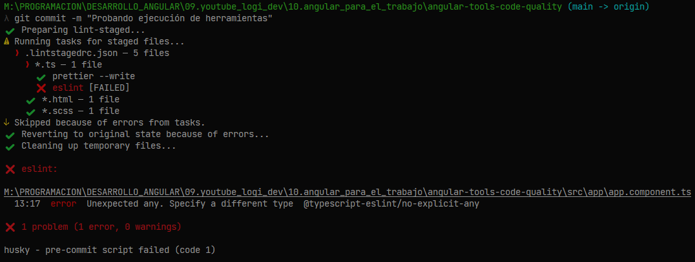

Como resultado `no se realizó el commit`, dado que `eslint` ha detectad fallas en el archivo `app.component.ts`, tal como se ve a continuación:

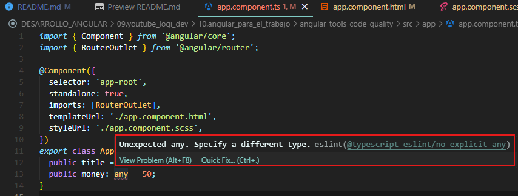

Si damos click en `Quick Fix...` veremos una lista de posibles soluciones que se pueden aplicar de manera automática:

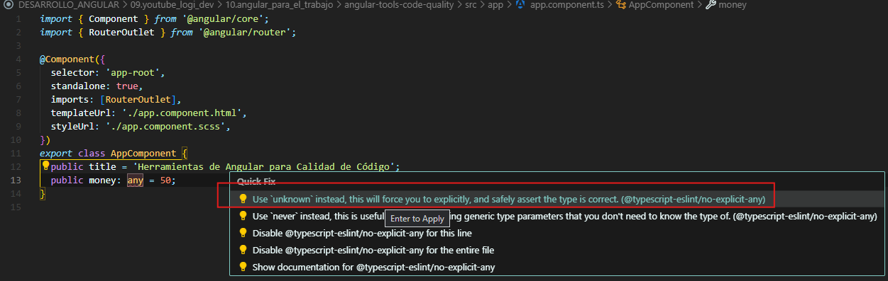

Finalmente, vemos que en las nuevas versiones de Angular de Typescript se recomienta usar el `unknown` en reemplazo de `any`:

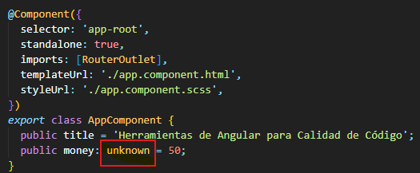

Luego de haber solucionado todos los errores que se han detectado, volvemos a subir los cambios al repositorio, esta vez el `commit` pasará sin ningún problema.

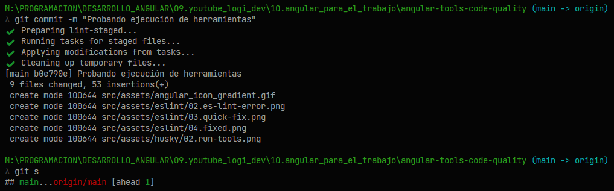
