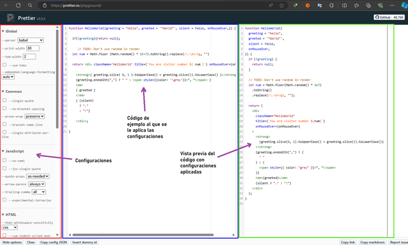

# [Curso Angular 17 para el trabajo: Prettier + ESlint + Husky + Lintstaged](https://www.youtube.com/watch?v=gRMuLqOYIB0&t=16s)

- Curso tomado del canal de Youtube de LogiDev.
- This project was generated with [Angular CLI](https://github.com/angular/angular-cli) version 17.3.5.

---

## [Prettier](https://prettier.io/)

Es una herramienta de formateo de código. Su objetivo principal es asegurarse de que tu código se vea consistente y ordenado, sin importar quién lo haya escrito.

`Prettier` se encarga de ajustar el formato del código (por ejemplo, el espaciado, el uso de comillas, la longitud de las líneas, etc.) según reglas predefinidas. Esto hace que sea más fácil de leer y mantener el código, ya que todos los desarrolladores en un proyecto siguen el mismo estilo.

### Cómo generar configuraciones de prettier

A modo introductorio, vamos a ver cómo podemos generar configuraciones de prettier para usarlo en nuestros proyectos. El primer paso es ir a la siguiente dirección https://prettier.io/playground/ donde observaremos la siguiente interfaz:



La interfaz anterior está dividito en tres secciones:

1. Configuraciones
2. Código a la que se aplicarán las configuraciones
3. Vista previa del código con configuraciones aplicadas

Las configuraciones que realicemos debe ser de acuerdo a nuestras necesidad, de acuerdo al proyecto en el que vamos a trabajar, en ese sentido, todo el equipo debe estar de acuerdo con estas configuraciones, dado que todos vamos a trabajar con lo mismo.

Suponiendo que ya hemos jugado con las configuraciones y tenemos el que necesitamos para nuestro proyecto. El siguiente paso sería generar el `json` de estas configuraciones, para eso, damos clic en el botón `Copy config JSON`, tal como se ve a continuación:


Como resultado, tendremos copiado un json con las configuraciones realizadas que podemos usarlo más adelante en nuestro editor de código.

```json
{
  "arrowParens": "always",
  "bracketSameLine": false,
  "bracketSpacing": true,
  "semi": true,
  "experimentalTernaries": false,
  "singleQuote": false,
  "jsxSingleQuote": false,
  "quoteProps": "as-needed",
  "trailingComma": "all",
  "singleAttributePerLine": false,
  "htmlWhitespaceSensitivity": "css",
  "vueIndentScriptAndStyle": false,
  "proseWrap": "preserve",
  "insertPragma": false,
  "printWidth": 120,
  "requirePragma": false,
  "tabWidth": 2,
  "useTabs": false,
  "embeddedLanguageFormatting": "auto"
}
```

## [ESLint](https://eslint.org/)

Es una herramienta para identificar y corregir problemas en tu código Javascript o Typescript. A diferencia de Prettier, que se enfoca en el formato del código, `ESLint` se centra en encontrar errores y problemas de calidad del código, como variables no utilizadas, errores de sintaxis, problemas de rendimiento y buenas prácticas de programación. `ESLint` es altamente configurable, lo que significa que puedes definir tus propias reglas o usar reglas predefinidas según los estándares de la comunidad.

Al igual que prettier, `ESLint` también tiene su [playground](https://eslint.org/play/) donde podemos jugar buscando las configuraciones que necesitemos, aunque como se mencionó en el párrafo anterior, `ESLint` viene con configuraciones predefinidas.

## Husky

Es una herramienta que permite ejecutar scripts de Git Hooks de forma sencilla. Los Git Hooks son scripts que Git ejecuta antes o después de ciertos eventos, como commits, push o merges.

- Es una herramienta que permite ejecutar scripts de `Git hooks`, como `pre-commit`, `pre-push`, `post-commit`, `post-push`, etc.
- Te permite automatizar tareas como la ejecución de linters, formateadores, pruebas, y otras verificaciones antes de realizar commits o push.
- Con Husky, puedes asegurarte de que tu código siempre pase ciertas verificaciones antes de ser enviado al repositorio.

Ten en cuenta que existen hooks del lado del cliente y servidor.

- `Hooks del lado del cliente`: quien va a ejecutar la acción del `commit` o `push` es el desarrollador, entonces los `hooks` que se ejecutarán del lado del cliente serán los `pre-commit`, `pre-push`, `post-commit`, `post-push`.

- `Hooks del lado del servidor`: suponiendo que el repositorio a donde estamos pusheando el código está en `GitHub`, entonces, en el servidor el repositorio detectará que se está haciendo un push, por lo que se se activará un hook del lado del servidor y realizará alguna acción como verificar o ejecutar alguna acción, etc.

**Nota**
- Nosotros estaremos aplicando los `Git Hooks` del lado del cliente, específicamente nos enfocaremos en el `pre-commit`.
- Utilizaremos `Husky` para poder ejecutar `Prettier` y `ESLint` antes de realizar algún `commit` o `push`.

### Funcionamiento de Husky

Como developer hago mi `git commit`, la herramienta `Husky` detectará qué `hook` estamos utilizando de git, en nuestro caso será `pre-commit`. En ese `pre-commit` nosotros colocaremos que se desencadene la ejecución de `Prettier` (formatee nuestro código) y `ESLint` (inspeccione nuestro código a ver si hay algún problema de codificación). Si todo está bien, entonces se procede a realizar el `commit`, caso contrario no se ejecutará el `commit`.


## LintStaged

Es una librería que detecta qué archivos han sido modificados para que se apliquen únicamente a ellos las reglas que nosotros indiquemos: `format`, `linter`, etc. En otras palabras, si no usamos esta librería de `LintStaged` las reglas que hayamos definido `format`, `linter`, etc. se aplicarán a todo el proyecto.

---

# Configurando VS Code y Angular para usar herramientas de calidad de código

---

## Extensiones en VS Code

Para el tema de calidad del código necesitamos instalar las siguientes extensiones en nuestro VS Code:

- Prettier - Code formatter
- ESLint

## Estableciendo Prettier como formateador por defecto

Primero debemos instalar la dependencia de `Prettier` en nuestro VS Code. Luego debemos establecer Prettier como formateador por defecto de la siguiente manera.

`Primer paso`, en un archivo cualquiera damos clic secundario y seleccionamos `Format Document With...`.


`Segundo paso`, configuramos el formateador por defecto.


`Tercer paso`, seleccionamos a `Prettier` como nuestro formateador por defecto.


## Activar Configuración Requerida de Prettier

`Prettier: Require Config`, requiere un archivo de configuración `Prettier` para formatear. Esta configuración le dice a VS Code que formatee el código del proyecto en base a un archivo de configuración de `Prettier` llamada `.prettierrc` (si es que lo tiene) que estará ubicada en la raíz del proyecto. Este archivo de configuración `.prettierrc` tendrá el `.json` que copiamos de la página de playground de prettier.


## Instalando dependencia de ESLint en Angular

En nuestro proyecto de Angular, instalaremos la dependencia de [angular-eslint](https://github.com/angular-eslint/angular-eslint) con el siguiente comando:

```bash
$ ng add @angular-eslint/schematics
```

Finalizada la instalación veremos que nos ha creado un archivo llamado `.eslintrc.json` en nuestra aplicación de `Angular 17`. Ahora, si estuvieramos usando la `versión 18 de Angular`, el archivo que crearía sería un `eslint.config.js`. Ambos representan lo mismo, solo que en una versión está en `json` y en la otra en un archivo de `JavaScript`.


